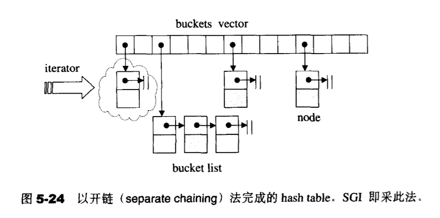
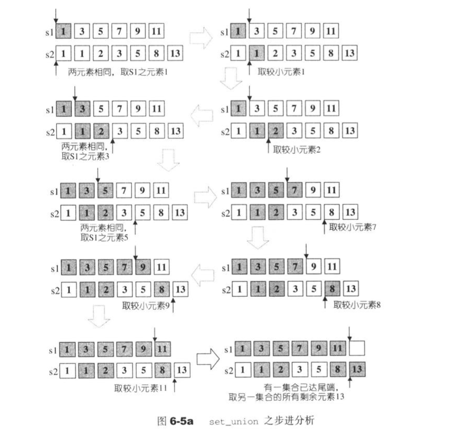
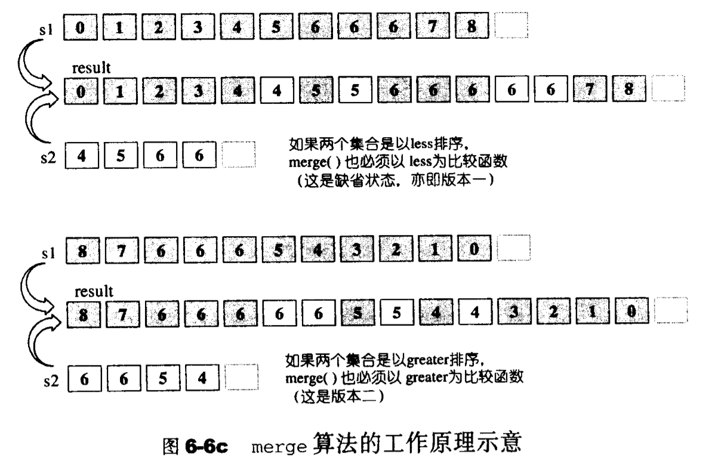
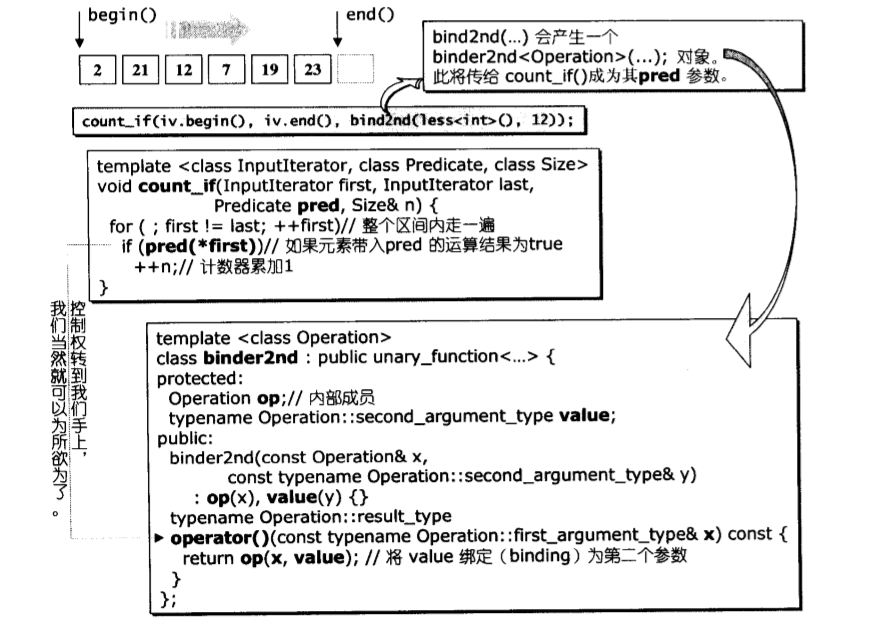

## STL源码解析

* **STL中容器实际是以class template完成，算法实际是以function template完成，仿函数实际是以operator()的class template，迭代器实际是一种operator++和operator*的泛化指针的 class template**
### 第一章：STL源码概述与版本介绍
* 前闭后开区间[first, last)，表示从first开始，直到last-1，迭代器最后一个指的是最后一个元素的下一个位置，如下图所示
> 
* STL中的迭代器实际上可以理解为一种泛化的指针类型，重载了operator*(), operator->(),operator++()和operator++(int)
* 仿函数实际上是重载了 
```c++
template<typename T>
class C{
public:
	T operator()(param lists){
		...
	}
};

int main(){
	C<T> cObj;

	//以下使用仿函数，就像使用一般函数一样
	cout << cObj(value lists) << endl;

	//以下使用仿函数，会先产生临时对象（第一对小括号），然后临时对象调用第二对小括号
	cout << cObj()(value lists) << endl;

	return 0;
}
```

### 第二章：空间配置器
* SGI 虽然也定义有一个符合部分标准、名为allocator的配置器，但是SGI却从未使用过，也不建议我么使用，主要是因为其效率不佳，他只是把C++的::operator new 和::operator delete 做了一层薄薄的包装
* STL规定的配置器结构示意图如下
> 

### 第三章：迭代器概念与traits编程技法
* STL的中心思想就是将容器和算法分开，彼此独立设计，最后通过一个迭代器使他们链接在一起（迭代器扮演桥梁的作用）
* 迭代器相应型别有五种
> 1. value type:是指迭代器所指对象的型别
> 2. difference type：是指两个迭代器之间的距离，可以用来表示一个容器的最大容量
> 3. reference type 
> 4. pointer type
> 5. iterator_category：包括input iterator（只读）,output iterator（维写）, forward iterator, bidirectional iterator（双向迭代器）, random access iterator（随机迭代器，支持偏移量大于1）
* [traits编程](https://blog.csdn.net/shudou/article/details/10270971 "traits编程详解")主要是帮助算法识别迭代器的属性（通过内嵌的类型声明），提升算法的运行效率
```c++
template<typename Iterator, typename T>
void func_impl(Iterator iter, T t)
{
    T temp;//这里就解决了问题
    //这里做原本func()的工作
}
 
template<typename Iterator>
void func(Iterator iter)
{
    func_impl(iter, *iter);//func的工作全部都移到func_impl里面了
}
 
int main(int argc, const char *argv[])
{
    int i;
    func(&i);
}
//函数func作为对外接口，实际的操作却由函数func_impl执行，通过函数func_impl的参数类型推导，获取到Iterator指向对象的类型T，但是如果需要返回类型是迭代器所指对象的类型，其无能为力了
```

### 第四章：序列容器
### 1. vector概述
* vector是动态的array，当容量不足时以两倍的方式进行扩容，然后完成元素的搬迁和原空间的释放，位于头文件<vector>中

**1.1. vector定义摘要**
* SGI STL将vector实现于更底层的<stl_vector.h>

**1.2. vector的迭代器**
```c++
//vector容器的迭代器模板
tempalte <typename T, class Alloc = alloc>
class vector{
public:
	typedef T value_type;
	typedef value_type* iterator;
...
};
```
**1.3. vector的数据结构**
* vector采用的数线性连续空间，它以两个迭代器start和finish分别指向配置来的连续空间目前已经使用的范围，并以迭代器end_of_storage指向整个连续空间的尾端（包含备用空间）。具体示意图如下图所示

```c++
template <typename T, class Alloc = alloc>
class vector{
//嵌套类型
public:
	typedef T           value_type;
	typedef value_type* pointer;
	typedef value_type* iterator;
	typedef value_type& reference;
	typedef size_t      size_type;
	typedef ptrdiff_t difference_type;
...
protected:
	iterator start;
	iterator finish;
	iterator end_of_storage;

public:
	iterator begin(){return start;}
	iterator end(){return finish;}
	size_type size() const{return size_type(end() - begin());}
	size_type capacity() const{return size_type(end_of_storage - begin());}
	bool empty(){return begin() == end();}
	reference operator[](size_type n) {return *(beging() + n);}
	reference front() {return *(begin());}
	reference back() {return *(end() - 1);}
...
};
```
> 

**1.4. vector 的构造与内存管理**
* vector提供了很多默认的构造函数，其中一个允许我们指定空间大小及初值
```c++
//构造函数
vector(size_type n, const T& value){fill_initialize(n, value);}

//填充并初始化
void fill_initialize(size_type n, const T& value){
	start = allocate_and_fill(n, value);
	finish = start + n;
	end_of_storage = finish;
}

//配置而后填充
iterator allocate_and_fill(size_type n, const T& x){
	iterator result = data_allocator::allocate(n); //配置n个元素空间
	uninitialized_fill_n(result, n, x); //会根据第一参数的型别特性决定使用算法fill_n()或反复调用construct()
	return result;
}
```
* push_back()将新元素插入时会先检测是否还要备用空间，有的话直接插入并调整finish++，否则就扩充空间（重新配置两倍大小空间->移动数据->释放原来的空间），这个过程会使院迭代器失效，因此需要赋值给一个新的迭代器

**1.5. vector的元素操作：pop_back, erase,clear,insert**

#### 2. list概述
* list是一个双向链表，空间不是连续的，对于删除和插入永远是常数个时间
```c++
template <typename T>
struct __list_node{
	typedef void* void_pointer;
	void_pointer prev; // void型，其实可以设为__list_node<T>*
	void_pointer next;
	T data;
}
```
* list的插入和删除只会使被操作的节点的迭代器失效，因为其地址不是连续的，因此只需要对迭代器指针++即可，而vector由于其连续的存储空间会导致元素位置的前移或后移而使得所有迭代器指针失效
> 

**2.1. list的构造与内存管理**
* list_test.cpp测试了list的部分操作
* 它的构造和析构同vector大致相似
* list提供一个默认的构造函数不指定任何参数而创建一个空list，如下图所示
```c++
public:
	list(){empty_initialize();}

protected:
	void empty_initialize(){
		node = get_node();
		node -> prev = node;
		node -> next = node;
	}
```
> 
* list的push_back()函数内部实际上调用的是insert函数
```c++
void push_back(const T& x){ insert(end(), x);}
```
**2.2 list的操作**
* 常见的操作有push_front(),push_back(),erase(),pop_front(),pop_back(),clear(),remove(),unique(),splice(),merge(),reverse(),sort()
* 由于list不是连续的因此clear()nebula是不是通过erase删除区间来执行的，而是通过循环遍历一个一个节点删除，析构的
* list内部提供了一个所谓的迁移操作（transfer）：将某连续范围内的元素迁移到指定的位置之前。这也是为实现splice、sort和merge等奠定了基础

#### 3. deque

**3.1 deque概述**
* 是一个双向开口的连续线性存储空间，即容器两端都可以进行插入和删除操作，示意图如下
> 
* deque和vector的区别在于，前者没有容量的概念，因为它是一个动态分段连续的空间组成的（也称为缓冲区，可以看做是一个个的vector组成），有段控中心对分配的每一段进行管理（段控中心实际上就是一个map,每一个map对应管理一个连续的缓存空间区)
* deque 本身比较复杂其内部的实现，因此其迭代器的实现也很复杂，主要在分段连续中的迭代器的++或--和跳转操作等如何实现平滑的转移而让用户没有察觉，因此在能用vector解决问题的时候，尽量不要使用deque
* deque内部的排序是通过先把元素复制到vector中排好序后再复制回来
* 

**3.2 deque的迭代器**
* deque的中控器（控制中心）、缓冲区、迭代器的示意图如下所示
> 
* 注：迭代器中包含四部分
> 1. cur表示所指的缓冲区中现行元素（deque是由多个缓冲区拼接而成的），如上图所示
> 2. first 表示此迭代器所指缓冲区的头
> 3. last表示此迭代器所指指缓冲区的尾（含备用空间）
> 4. node 指向段控中心，对应map中的哪一个节点

**3.3 deque的数据结构**
* 和其它序列容器相似

**3.4 deque的构造与内存管理**
* deque的段控中心map一般会前后预留一些，以便扩充时用
* map的每个节点对应一个缓冲区（一个缓冲区一般是一个连续的vector实现）map start指针刚开始一般位于段控中心中部，这样便于头尾的扩充
* 当缓冲内容不足时会触发push_back_aux()先配置一块新的缓冲区，再设新元素内容，然后更改迭代器finish的状态
* 具体可以通过以下两个图理解，第二个图对应的是触发了push_back_aux()
> 
> 
* 前端插入同后端插入原理相似，触发的是push_front_aux()函数而已

**3.5 deque的常见操作**
* pop_back(),pop_front(),push_back(),push_front(),clear(),erase(),insert(),empty(),size()等

#### 4. stack

**4.1 概述**
* stack是一种后进先出的数据结构，只允许对栈顶的元素进行操作，位于头文件```<stack>```中。不存在遍历行为，因此没有迭代器，结构如下图所示
> 
* stack的底层默认实现是deque，是对其进行了一些定制化的改变，因此也称为容器适配器
```c++
template <typename T, class Sequence = deque<T> >
class stack{
	.....
};
```
* stack 也可以使用list作为其底层的序列容器，因为list也满足双端开口和一些基本的容器函数

#### 5. queue

**5.1 概述**
* queue是一种先进先出的数据结构，位于头文件```<queue>```中，只允许从队尾插入新值，从队首删除元素，其它位置元素则不可获取或操作，也没有迭代器，结构如下图所示
> 
* queue的底层默认实现是deque，是对其进行了一些定制化的改变，因此也称为容器适配器
```c++
template <typename T, class Sequence = deque<T> >
class queue{
	.....
};
```

#### 5. heap

**5.1 概述**
* heap不属于STL容器的组建，但是他是实现优先队列的底层机制
* heap内部是一个完全二叉树，可以用一个数组或vector表示，位置0表示堆顶元素，根据堆顶元素可以分为max-heap和min-heap
> max-heap指的是二叉树中的每一个父节点都大于其左右子节点，STL默认的是max-heap
> min-heap指的是二叉树中的每一个父节点都小于其左右子节点

**5.2 heap算法**
* push_heap算法，实际上就是一个堆排序算法，通过不断地调整二叉树中父节点和左右子节点的大小而实现的
> 可参见我的[排序算法-堆排序](https://github.com/yongfali/JianzhiOffer/blob/master/allSort.cpp "堆排序算法代码")
> 
* pop_heap算法，每次取出堆顶元素然后调整元素使之为新的堆，<strong>实际上是把堆顶元素放入到vector或array的尾端，完成删除操作。</strong> 同push_heap算法实现原理一样，都对应堆排序
> 
* 
sort_heap算法实际就是不断的pop然后调整堆顶元素的过程，从而达到排序的过程，大顶堆可以实现递增排序，小顶堆可以实现递减排序
* make_heap算法，生成堆的过程,传入迭代器的首尾指针即可
* heap的测试见heap_test.cpp 

#### 6. priority_queue

**6.1 概述**
* 可以理解为一个拥有权值的queue，缺省情况下是一个max-heap，内部实现的默认容器是vector，再加上heap的处理规则就行，也是一种容器适配器
```c++
template <typename T, class Sequence = vector<int>
			class Compare = less<typename Sequence::value_type> >
class  priority_queue{
	....
};
```
*  priority_queue 位于头文件```c++ <queue> ```中，没有迭代器，只能对队首的元素进行读取操作，因此也不提供遍历的功能

#### 7. slist

**7.1 概述**
* Slist与list的区别在于前者是单向链表，并且不是STL中标准的容器，不过单向链表消耗的空间更小，某些操作效率更高
* 由于单向因此，在指定位置插入或删除都需要从头遍历链表因此，slist只提供了insert_after()和erase_after()，当然也不提供push_back，而是提供push_front，有点类似于倒序创建链表

### 第五章：关联式容器
* 标准的关联式容器包括set和map，以及他两的衍生体multiset和multimap，他们的底层实现均为红黑树
* SGI STL还提供了不在标准规范之内的关联容器，hash_set和hash_map，以及对应的hash_multiset和hash_multimap，他们的底层均为hashmap
> 
**1. 树的介绍**
* 平衡树指的是任意一个节点的左右子树的深度之差不超过1，限制这一条件主要是为了防止树在频繁的插入和删除过程中退化为单链表
* 树的平衡被破坏指的是某个节点的左右子树的深度之差为2，具体可以分为以下四种情况
> 1. 插入节点位于X的左子节点的左子树-左左
> 2. 插入节点位于X的左子节点的右子树-左右
> 3. 插入节点位于X的右子节点的左子树-右左
> 4. 插入节点位于X的右子节点的右子树-右右
> 

* 针对以上四种情况其中1和4称为外侧插入，可以通过单旋转的方式进行调整，2和3称为内侧插入，可通过双旋转方式调整
>  

* **右旋即将当前节点调转至其左孩子节点的右节点，左旋则为右孩子的左节点，红黑树旋转只此两种。实际上只针对不平的点进行旋转调整**

**1.2 红黑树（RB-tree）**
* 也是一种特殊二叉搜索树，作为关联容器的底部实现机制，具有以下性质
> 1. 每个节点不是红色就是黑色
> 2. 根节点为黑色
> 3. 如果某一节点为红色，其子节点必须为黑色，也就是父子节点不能同时为红色【新增节点之父节点必须为黑】
> 4. 任一节点到树的尾端（NULL，也被视为黑节点）的任何路径，所含的黑节点树必须相同【该条款决定插入的新节点必须为红色】

* 对于二叉搜索树而言其极值是很容易找到的，分别位于最左和最右
```c++
static base_ptr minnum(base_ptr pt){
	while(pt->left != nullptr)
		pt = pt -> left;
	return pt;
}

static base_ptr maxnum(base_ptr pt){
	while(pt->right != nullptr)
		pt = pt -> right;
	return pt;
}
```
**1.3 RB-tree的元素操作**
* 有两种插入操作，insert_unique()和insert_equal()，前者表示不允许插入重复的值，后者可以，插入之后需要对树进行平衡操作，即调用__rb_tree_rebalance()

**2. set**
* set是一个键和值相同的关联容器，会根据键值自动排序（由于底层是红黑树为平衡二叉搜索树），不允许重复的键值存在
* **set集合的迭代器为const_iterator，禁止对元素的值进行修改等操作**

```c++
template <typename Key, class Compare = less<Key>, class Alloc = alloc> //缺省采用递增排序
class set{
	...
};
```
* set 内部初始化实际调用的RB-tree的insert_unique()方法，实现键值的唯一，而multiset 才调用 insert_equal()

**3. map**

* map的特性是所有的元素会根据键值自动排序，map内部的键值对实际是一个pair对象，定义于<stl_pair.h>中
```c++
template <typename T1, typename T2>
struct pair{
	typedef T1 first_type;
	typedef T2 second_type;

	T1 first;
	T2 second;

	pair() : first(T1()), second(T2()){}
	pair(const T1& a, const T2& b) : first(a), second(b){}
};
```
* **map集合的迭代器为const_iterator，禁止对元素的值进行修改等操作**
* map的其它性质和操作同set相似

**4. multiset/multimap**
* 和set/map基本没有区，只是底层RB-tree的插入调用的都是insert_equal()，即允许重复值插入

**5. hashtable**
* hashtable容易产生hash冲突（常用的hash是求模取余法），解决的方法如下：
> 1. 线性探测：指的是当array对应位置被占据时，就对array循环探测每一个位置，直到有一个空位就插入，这样的缺陷就是探测时间开销过大，查找也类似当经过hash函数算出的位置不是目标值时，也进行循环线性搜索直到，找到该值
> 2. 二次探测：指的是当hash计算出的位置已经被占用时，不再线性探测空位置，而是采用 \\(s+1^2, s+2^2, s+3^2 ... s+i^2\\)，进行空位的探测
> 3. 拉链法：即当hash计算出的位置已经被占用时，在该位置创建一个链表，对数据进行串联起来形成单链表或双链表（若链表过长也可以生成红黑树，二叉树之类的）**这也是SGI STL的hashtable采用的办法，如下图所示**
> 

**5.1 hash function**
* 位于头文件<stl_hash_fun.h>，全都是仿函数，主要是用于计算元素的位置

**6. hash_set/hash_map**
* 其底层的实现机制都是hashtable，两容器提供的操作实际也是调用其底层hashtable的操作行为而已，但是他们两者相对于set/map而言，其元素是**无序**的，这是由于RB-tree的性质所决定的。其它的一些性质和操作两者并没有多大的区别
* 两者分别位于头文件<hash_set>和<hash_map>中
```c++
template <class value, class HashFcb = hash<table>,
			class EqualKey = equal_to<Value>,
			class Alloc = alloc>
class hash_set{
	....
};
```
**7. hash_multiset/hash_multimap**
* 其底层的实现机制都是hashtable，两容器提供的操作实际也是调用其底层hashtable的操作行为而已，但是他们两者相对于multiset/multimap而言，其元素同样是**无序**的，允许重复的值，因为hashtable底层插入的实现调用的是insert_equal()而不是insert_unique()
* 两者分别位于头文件<hash_set>和<hash_map>中

### 第六章：算法
* 算法性能衡量的重要指标是其**时间效率**和**空间开销**
* 质变算法和非质变算法的区别在于是否改变操作的对象值，不改变为非质变，反之为质变
* SGI STL中的算法都有其对应的底层实现，但是都封装于上层头文件<algorithm>中
* 
* 算法的泛型化指的是使该算法能够适应于不同的数据结构或数据对象

**6.1 数值算法（numeric）**
* 必须包含头文件<numeric>，SGI实现于<stl_numeric.h>
* 仿函数的头文件```c++ <functional>```

**6.2 基本算法**
* STL中的算法基本操作的是容器的**迭代器对象** 

**6.3 set相关算法**
* STL一共提供了四种与set相关的算法，分别是并集（union），交集（intersection），差集（difference），对称差集（symmetric difference）
* 6.3.1 set_union()，可构造两个集合的并集，以排序区间表示，返回一个迭代器**指向输出区间的尾端**
```c++
template<class InputIterator1, class InputIterator2, class OutputInterator>
OutputIterator set_union(InputIterator1 first1, InputIterator1 last1,
						InputIterator2 first2, InputIterator2 last2,
						OutputInterator result){
while(first1 != last1 && first2 != last2){
	if(*first1 < *first2){
		*result = *first1;
		++first1;
	}
	else if(*first1 > *first2){
		*result = *first2;
		++first2;
	}
	else{
		*result = *first1;
		++first1;
		++first2;
	}
	++result;
}
	//当一个区间到达尾端时结束循环，把剩下的值复制到result中
	return copy(first2, last2, copy(first1, last1, result));
} 
```
> 
* 6.3.2 set_intersection()，可构造两个集合的交集，以排序区间表示，返回一个迭代器**指向输出区间的尾端**
```c++
template<class InputIterator1, class InputIterator2, class OutputInterator>
OutputIterator set_intersection(InputIterator1 first1, InputIterator1 last1,
						InputIterator2 first2, InputIterator2 last2,
						OutputInterator result){
while(first1 != last1 && first2 != last2){
	if(*first1 < *first2){
		++first1;
	}
	else if(*first1 > *first2){
		++first2;
	}
	else{
		*result = *first1;
		++first1;
		++first2;
		++result;
	}
}
	return result;
} 
```
* 6.3.3 set_difference(),构造两个集合的差集s1-s2（表示只出现于s1，但不出现于s2)，以排序区间表示，返回一个迭代器**指向输出区间的尾端**
```c++
template<class InputIterator1, class InputIterator2, class OutputInterator>
OutputIterator set_difference(InputIterator1 first1, InputIterator1 last1,
						InputIterator2 first2, InputIterator2 last2,
						OutputInterator result){
while(first1 != last1 && first2 != last2){
	if(*first1 < *first2){
		*result = *first1;
		++first1;
		++first2;
		++result;
	}
	else if(*first1 > *first2){
		++first2;
	}
	else{
		++first1;
		++first2;
	}
}
	return copy(first1, last1, result);
} 
```
* 6.3.4 set_symmetric_difference()构造对称差集，即(s1-s2)$U $(s2-s1)，以排序区间表示，返回一个迭代器**指向输出区间的尾端**
```c++
template<class InputIterator1, class InputIterator2, class OutputInterator>
OutputIterator set_symmetric_difference(InputIterator1 first1, InputIterator1 last1,
						InputIterator2 first2, InputIterator2 last2,
						OutputInterator result){
while(first1 != last1 && first2 != last2){
	if(*first1 < *first2){
		*result = *first1;
		++first1;
		++result;
	}
	else if(*first1 > *first2){
		*result = *first2;
		++first2;
		++result;
	}
	else{
		++first1;
		++first2;
	}
}
	return copy(first2, last2, copy(first1, last1, result));
} 
```

**6.4 其它算法** 

**6.4.1 单纯的数据处理**
* 如果某一算法传入仿函数对象或者是配接器，那么它将作用于迭代器的每一个元素身上，如下for_each()算法的泛化模板
```c++
tempalte <typename InputIterator, typename Function>
Function for_each(InputIterator first, InputIterator last, Function f){
	for(; first != last; ++first)
		f(*first);

	return f;
}
```
* merge()：只应用于两个有序的区间进行合并，合并后仍然为有序区间，返回的是一个迭代器，指向最后结果序列的最后一个元素的下一个位置
> 
* reverse()：将容器内的元素翻转
* unique()：移除容器内**相邻的重复元素**，若对于无序数据，则只能保证相邻的相同元素被移除，因此可以先对容器排序
* next_permutation：下一个排列组合，STL提供的求排列组合算法的其中之一，该算法会取得[first,last)所标示序列的下一个排列组合，如果没有下一个则返回false，否则返回true,代码演示见**next_permutation_example.cpp**
> 
> 该图的描述：首先，从尾端开始往前寻找两个相邻的元素，令第一个元素为$*i$，第二个元素为$*ii$，且满足$*i < *ii$，找到这样一组相邻元素后，再从尾部开始往前检验，找到第一个大于$*i$的元素令其为$*j$，将i,j对调，再将ii之后的元素颠倒排列，这就是所求的下一个排列组合
* **next_permutation（）在使用前需要对欲排列数组按升序排序，否则只能找出该序列之后的全排列数**
* prev_permutation:前一个排列组合，可以枚举出一个降序排列的字符串的全排列，若是无序则也只能找出该序列之前的全排列组合

### 第七章：仿函数（函数对象）
* 主要作用是用作于模板算法的一个参数，从而使STL算法更加泛化，仿函数可以理解为模仿了函数的一些功能的对象
> 
* STL仿函数的分类，若依操作数的个数划分，可分为一元和二元仿函数，若以功能则分为算数运算，关系运算，逻辑运算。内置的仿函数都必须包含头文件```c++ <functional>```
* 仿函数的存在可以使得算法的适用性和灵活性大大提升
* 仿函数的型别主要用于表现函数参数型别和传回值型别

**7.1 unary_function**
* 用于呈现一元函数的参数型别和返回值型别
```c++
<!-- STl规定，每一个Adaptable Unary Function 都应继承此类别，继承后课自动获取参数类型或返回值类型 -->
template <class Arg, class Result>
struct unary_function{
	typedef Arg argument_type;
	typedef Result result_type;
};
```
**7.2 binary_function**
* 用于呈现二元函数的参数型别和返回值型别
```c++
<!-- STl规定，每一个Adaptable binary Function 都应继承此类别，继承后课自动获取参数类型或返回值类型 -->
template <class Arg1, class Arg2, class Result>
struct binary_function{
	typedef Arg1 first_argument_type;
	typedef Arg2 second_argument_type;
	typedef Result result_type;
};
```
* **以上这两个在C++98中适用较为频繁，c++11后使用较少**

**7.3 算数类仿函数**
* 包括以下6类
> 1. 加法：plus<T>
> 2. 减法：minus<T>
> 3. 乘法：multiplies<T>
> 4. 除法：divides<T>
> 5. 求模：modulus<T>
> 6. 否定：negate<T>
```c++
tempalte <class T>
struct plus : public binary_function<T, T, T>{
	T operator() (const T& x, const T& y) {return x + y; }
};

tempalte <class T>
struct minus : public binary_function<T, T, T>{
	T operator() (const T& x, const T& y) {return x - y; }
};

tempalte <class T>
struct multiplies : public binary_function<T, T, T>{
	T operator() (const T& x, const T& y) {return x * y; }
};

tempalte <class T>
struct dicides : public binary_function<T, T, T>{
	T operator() (const T& x, const T& y) {return x / y; }
};

tempalte <class T>
struct modulus : public binary_function<T, T, T>{
	T operator() (const T& x, const T& y) {return x % y; }
};

tempalte <class T>
struct plus : public unary_function<T, T, T>{
	T operator() (const T& x) {return -x ; }
};
```
* 证同元素：所谓运算op的证同元素，意思就是数值A若与钙元素做op运算，会得到A自身。如加法的证同元素是0，乘法的证同元素是1

**7.4 关系运算类仿函数**
* 包括以下六类：
> 1. 等于：equal_to<T>
> 2. 不等于：not_equal_to<T>
> 3. 大于：greater<T>
> 4. 大于等于：greater_equal<T>
> 5. 小于：less<T>
> 6. 小于等于：less_equal<T>
```c++
tempalte <class T>
struct equal_to : public binary_function<T, T, bool>{
	T operator() (const T& x, const T& y) {return x == y; }
};

tempalte <class T>
struct not_equal_to : public binary_function<T, T, bool>{
	T operator() (const T& x, const T& y) {return x != y; }
};

tempalte <class T>
struct greater : public binary_function<T, T, bool>{
	T operator() (const T& x, const T& y) {return x > y; }
};

tempalte <class T>
struct greater_equal : public binary_function<T, T, bool>{
	T operator() (const T& x, const T& y) {return x >= y; }
};

tempalte <class T>
struct less : public binary_function<T, T, bool>{
	T operator() (const T& x, const T& y) {return x < y; }
};

tempalte <class T>
struct less_equal : public binary_function<T, T, bool>{
	T operator() (const T& x, const T& y) {return x <= y; }
};
```

**7.5 逻辑运算类仿函数**
* 包括以下三类：
> 1. 逻辑与：logical_and<T>
> 2. 逻辑或：logical_or<T>
> 3. 逻辑非：logical_not<T>

```c++
tempalte <class T>
struct logical_and : public binary_function<T, T, bool>{
	T operator() (const T& x, const T& y) {return x && y; }
};

tempalte <class T>
struct logical_or : public binary_function<T, T, bool>{
	T operator() (const T& x, const T& y) {return x || y; }
};

tempalte <class T>
struct logical_not : public unary_function<T, bool>{
	T operator() (const T& x) {return !x; }
};

```

**7.6 证同(identity)，选择(select)，投射(project)**

* 证同：不对元素做任何改变，原样输出
```c++
struct identity : public unary_function<T, T>{
	const T& operator()(const T& x) const { return x;}	
};
```
* 选择：主要是针对RB-tree实现的map用于选择pair的值
```c++
template <class pair>
struct select1st : public unary_function<Pair, typename Pair::first_type>{
	const typename Pair::first_type& operator()(const Pair& x) const{
		return x.first;
	}	
};

template <class pair>
struct select2nd : public unary_function<Pair, typename Pair::second_type>{
	const typename Pair::second_type& operator()(const Pair& x) const{
		return x.second;
	}	
};
```
* 投射函数：传回第一参数，屏蔽第二参数，或者传回第二参数，屏蔽第一参数
```c++
template <class Arg1, class Arg2>
struct project1st : public binary_function<Arg1, Arg2, Arg1>{
	Arg1 operator()(const Arg1& x, const Arg2&) const {return x;}
};

template <class Arg1, class Arg2>
struct project2nd : public binary_function<Arg1, Arg2, Arg2>{
	Arg2 operator()(const Arg1&, const Arg2& y) const {return y;}
};
```
### 第八章：配接器（adapters）
* 配接器也叫适配器，包括容器配接器（stack和queue，实际上都是对容器deque的一些封装），迭代器配接器，仿函数配接器三种
* 迭代器配接器必须包含头文件<iterator> 
> 1. insert iterator: 提供三个函数back_inserter()，front_inserter()，inserter()，当客户端对insert iterator做赋值操作时，将其转换为对容器的插入操作，也就是内部在重载operator=时实际上调用的是push_back()或者push_front()或者insert()
> 2. reverse iterator: 可以让迭代器反转实现，从尾端开始遍历，其内部运算符重载实现正好相反，因为元素实际位置并没有改变，而是逻辑位置变化而已，如下图所示

> 3. iostream iterator: 将迭代器绑定到对应的iostream上使之具有其对应的功能例如 
```c++ 
<!-- 将outite绑定到cout，每次对outite指派一个元素，然后接一个" " -->
ostream_iterator<int> outite(cout, " ");
``` 
* 仿函数配接器是数量最庞大的一个集群，这些都位于头文件<functional>中，SGI STL将他们实际定义于<stl_function.h>中
* 仿函数配接器与算法组合可以创造出各种可能的表达式，大大的提升算法的泛化性的和多样性
```c++
 // bind1st函数代表这么一个操作:  x op value 
 bind1st(const Operation& op, const T& x)	

 //bind2nd函数代表：value op x	
 bind2nd(const Operation& op, const T& x)

 //value 是被应用bind函数的对象，也就是仿函数作用的每一个元素对象
 ```
* 仿函数适配器，作为算法的参数时，实际其内部会先产生一个仿函数临时对象（也就是函数指针）供算法调用作用于算法操作的容器的每一个迭代器指向的数据，具体案例如下
> 

*仿函数配接器包括以下几个常见的的
> 1. 对返回值进行逻辑否定：not1,not2，前者是对单目元素的否定，后者是两个元素运算的否定（如源码中 return !pred(x, y);）
> 2. 对参数进行绑定 bind1st, bind2nd如上代码解释
> 3. 用于函数合成 compose1,compose2
> compose1可以看做两个unary functions f() and g(), 改配接器用来产生一个h(),使得h(x) = f(g(x))
> compose2,已知一个binary function f() ,两个unary functions g1() and g2(), 改配接器用来产生一个h(),使得h(x) = f(g1(x), g2(x))

* **用于函数指针：ptr_fun** 
* 将一个普通函数适配成仿函数供算法使用
* **用于成员函数指针：mem_fun, mem_fun_ref**
* 将成员函数当做仿函数来使用，搭配各种算法，可以参见mem_fun_example.cpp用法  

