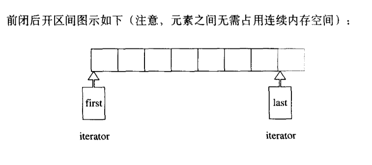
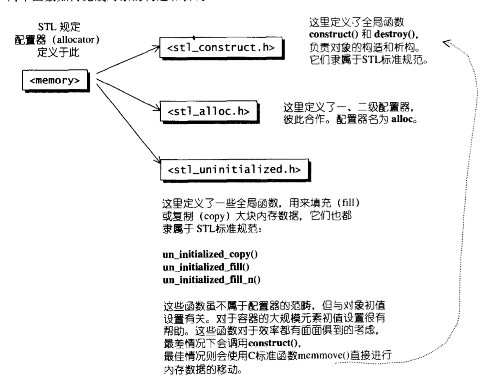

## STL源码解析

### 第一章：STL源码概述与版本介绍
* 前闭后开区间[first, last)，表示从first开始，直到last-1，迭代器最后一个指的是最后一个元素的下一个位置，如下图所示
> 
* STL中的迭代器实际上可以理解为一种泛化的指针类型，重载了operator*(), operator->(),operator++()和operator++(int)
* 仿函数实际上是重载了 
```c++
template<typename T>
class C{
public:
	T operator()(param lists){
		...
	}
};

int main(){
	C<T> cObj;

	//以下使用仿函数，就像使用一般函数一样
	cout << cObj(value lists) << endl;

	//以下使用仿函数，会先产生临时对象（第一对小括号），然后临时对象调用第二对小括号
	cout << cObj()(value lists) << endl;

	return 0;
}
```

### 第二章：空间配置器
* SGI 虽然也定义有一个符合部分标准、名为allocator的配置器，但是SGI却从未使用过，也不建议我么使用，主要是因为其效率不佳，他只是把C++的::operator new 和::operator delete 做了一层薄薄的包装
* STL规定的配置器结构示意图如下
> 

### 第三章：迭代器概念与traits编程技法
* STL的中心思想就是将容器和算法分开，彼此独立设计，最后通过一个迭代器使他们链接在一起（迭代器扮演桥梁的作用）
* 迭代器相应型别有五种
> 1. value type:是指迭代器所指对象的型别
> 2. difference type：是指两个迭代器之间的距离，可以用来表示一个容器的最大容量
> 3. reference type 
> 4. pointer type
> 5. iterator_category：包括input iterator（只读）,output iterator（维写）, forward iterator, bidirectional iterator（双向迭代器）, random access iterator（随机迭代器，支持偏移量大于1）
* [traits编程](https://blog.csdn.net/shudou/article/details/10270971 "traits编程详解")主要是帮助算法识别迭代器的属性（通过内嵌的类型声明），提升算法的运行效率
```c++
template<typename Iterator, typename T>
void func_impl(Iterator iter, T t)
{
    T temp;//这里就解决了问题
    //这里做原本func()的工作
}
 
template<typename Iterator>
void func(Iterator iter)
{
    func_impl(iter, *iter);//func的工作全部都移到func_impl里面了
}
 
int main(int argc, const char *argv[])
{
    int i;
    func(&i);
}
//函数func作为对外接口，实际的操作却由函数func_impl执行，通过函数func_impl的参数类型推导，获取到Iterator指向对象的类型T，但是如果需要返回类型是迭代器所指对象的类型，其无能为力了
```

### 第四章：序列容器
1. vector概述
* vector是动态的array，当容量不足时以两倍的方式进行扩容，然后完成元素的搬迁和原空间的释放，位于头文件<vector>中

2. vector定义摘要
* SGI STL将vector实现于更底层的<stl_vector.h>

3. vector的迭代器
```c++
//vector容器的迭代器模板
tempalte <typename T, class Alloc = alloc>
class vector{
public:
	typedef T value_type;
	typedef value_type* iterator;
...
};
```
4. vector的数据结构
* vector采用的数线性连续空间，它以两个迭代器start和finish分别指向配置来的连续空间目前已经使用的范围，并以迭代器end_of_storage指向整个连续空间的尾端（包含备用空间）。具体示意图如下图所示

```c++
template <typename T, class Alloc = alloc>
class vector{
//嵌套类型
public:
	typedef T           value_type;
	typedef value_type* pointer;
	typedef value_type* iterator;
	typedef value_type& reference;
	typedef size_t      size_type;
	typedef ptrdiff_t difference_type;
...
protected:
	iterator start;
	iterator finish;
	iterator end_of_storage;

public:
	iterator begin(){return start;}
	iterator end(){return finish;}
	size_type size() const{return size_type(end() - begin());}
	size_type capacity() const{return size_type(end_of_storage - begin());}
	bool empty(){return begin() == end();}
	reference operator[](size_type n) {return *(beging() + n);}
	reference front() {return *(begin());}
	reference back() {return *(end() - 1);}
...
};
```
> 
